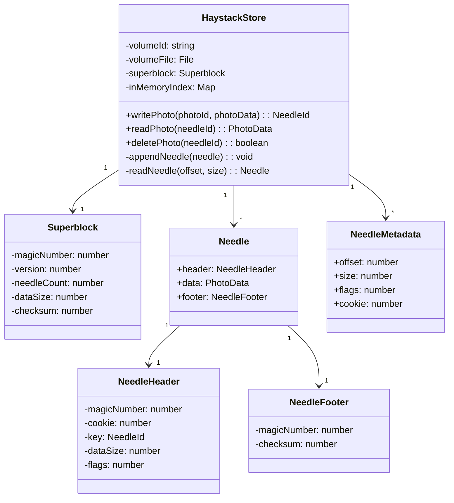
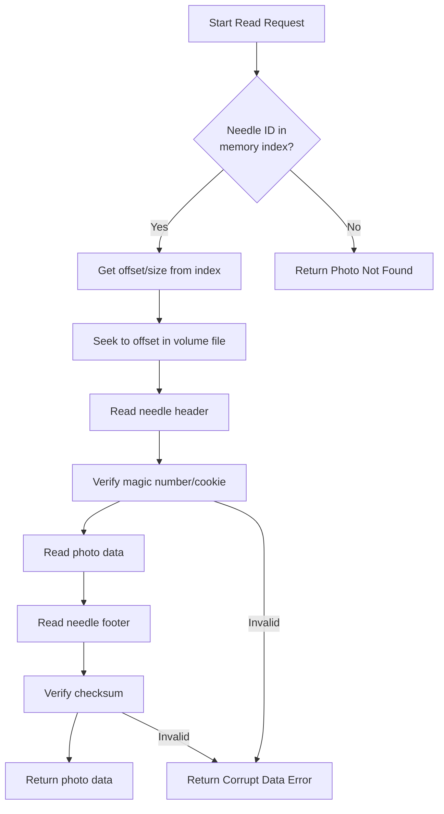
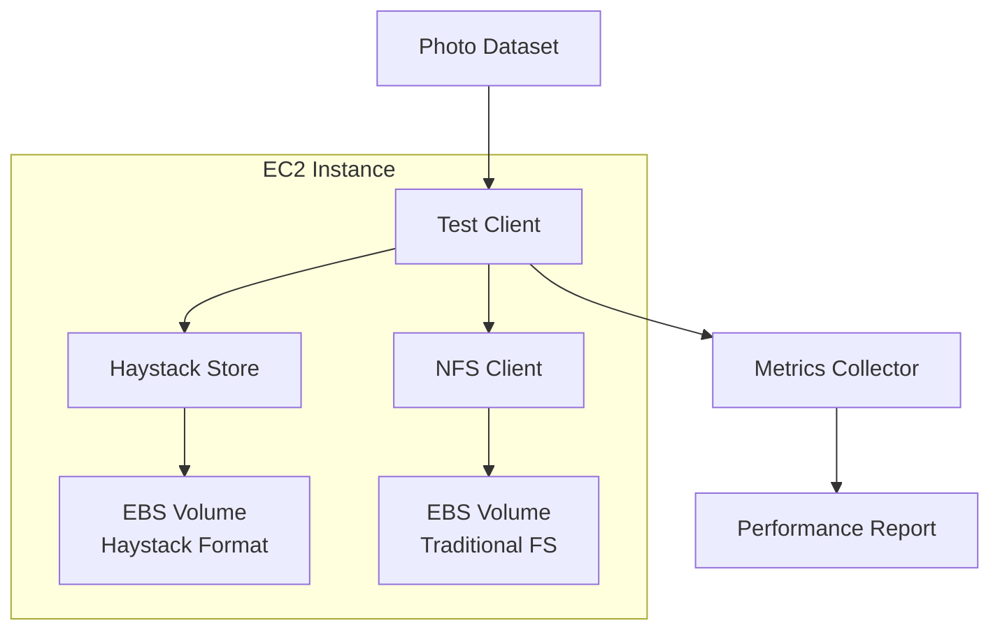
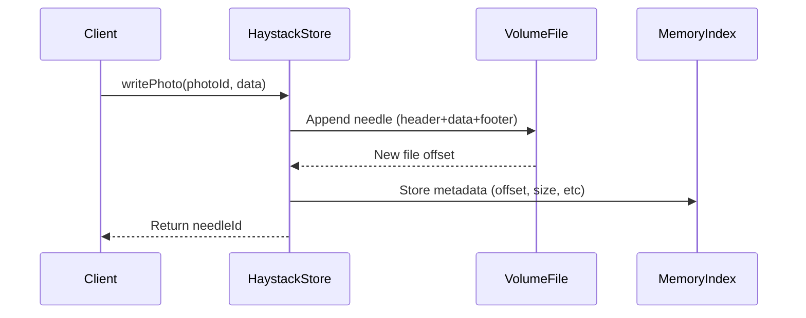

# CS5296 Projects

## Components

### The Store

Class Diagram

Key points:

- The HaystackStore class manages the entire volume file
- Photos are stored as "Needles" within the volume file
- All metadata is kept in memory (inMemoryIndex)
- Superblock contains volume-level metadata
- Each Needle has header, photo data, and footer

Activity Diagram for Photo Read Operation

Component Diagram for Stage 1 Testing

Sequence Diagram for Photo Write

Keypoints:

1. Implementation Recommendations for TypeScript:
   For the volume file operations, consider using Node.js fs module with async APIs
2. Use a Map object for the in-memory index (O(1) lookups)
3. Implement proper file locking for concurrent access
4. Consider using Protocol Buffers or similar for binary serialization of needles
5. For performance testing against NFS, you might want to:
   - Create a test harness that generates synthetic photo requests
   - Measure operations per second, latency distributions
   - Track memory usage and I/O patterns
